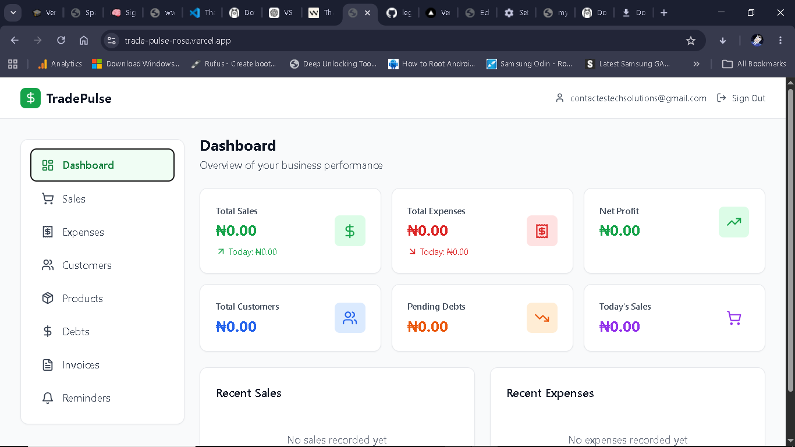

# TradePulse



**TradePulse is a fast, WhatsApp-first money tracking app for small sellers, side hustles, and local businesses.**

Live demo: https://trade-pulse-rose.vercel.app

**Deployed on Vercel and ready for device testing.**

## Overview

TradePulse helps small business owners manage sales, expenses, customers, debts, invoices, reminders, and inventory—all from a modern PWA interface.

## Key Features

- Sales tracking with customer association and date-based reporting
- Expense logging with categories and date filtering
- Customer database with phone, email, and notes
- Debt/credit tracking and repayment status
- Invoice creation, download, and WhatsApp sharing
- Payment reminders with customer links
- Product inventory with stock and low-stock alerts
- Mobile-first responsive design and PWA install support

## Quick Start

### Local development

```bash
git clone https://github.com/legendONE382/Trade-Pulse.git
cd Trade-Pulse
npm install
npm run dev
```

Open `http://localhost:5173` in your browser.

### Production build

```bash
npm run build
npm run preview
```

The production files are generated in `dist/`.

## Deployment

### Vercel (recommended)

This app is already deployed at the URL above. Push to the `main` branch and Vercel will automatically build and deploy the latest changes.

1. Add required environment variables in the Vercel dashboard.
2. Confirm the site URL is listed in Supabase auth redirect settings.
3. Use the live demo link for cross-device testing.

## Supabase Setup

### Vercel (recommended)

1. Push the repository to GitHub
2. Import the project in Vercel
3. Vercel will detect Vite and deploy automatically
4. Add required environment variables if you use Supabase

### Chrome extension

Build and install the extension manually:

```bash
npm run build:extension
npm run package:extension
```

Then load the `dist` folder in Chrome via `chrome://extensions` with Developer mode enabled.

## Supabase Setup

This app uses Supabase for auth and database storage. If you want Supabase features:

1. Create a Supabase project
2. Set the project URL and anon key in `.env`
3. Create the required tables and policies using `SUPABASE_SETUP.md`

Environment variables:

```env
VITE_SUPABASE_URL=https://your-project.supabase.co
VITE_SUPABASE_ANON_KEY=your_anon_key
```

## App Structure

- `src/App.jsx` — routes and protected navigation
- `src/components` — layout, protected wrapper, UI pages
- `src/pages` — app screens: Dashboard, Sales, Expenses, Customers, Products, Debts, Invoices, Reminders
- `src/utils/supabaseStorage.js` — Supabase query helpers
- `src/lib/supabase.js` — Supabase client initialization
- `vite.config.js` — PWA setup and build config
- `tailwind.config.js` — styling and theme config

## Technologies

- React 18
- Vite
- Tailwind CSS
- React Router Dom
- Supabase
- Lucide React icons
- date-fns
- vite-plugin-pwa

## Notes

- The app supports local storage and Supabase persistence
- PWA install behavior works on supported browsers
- Some mobile browsers may require manual Add to Home Screen

## Contributing

If you want to improve TradePulse, feel free to open a PR or update the README with additional setup steps.

## License

This project is proprietary software.
